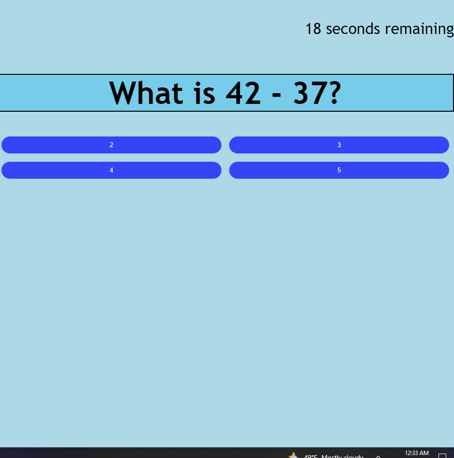
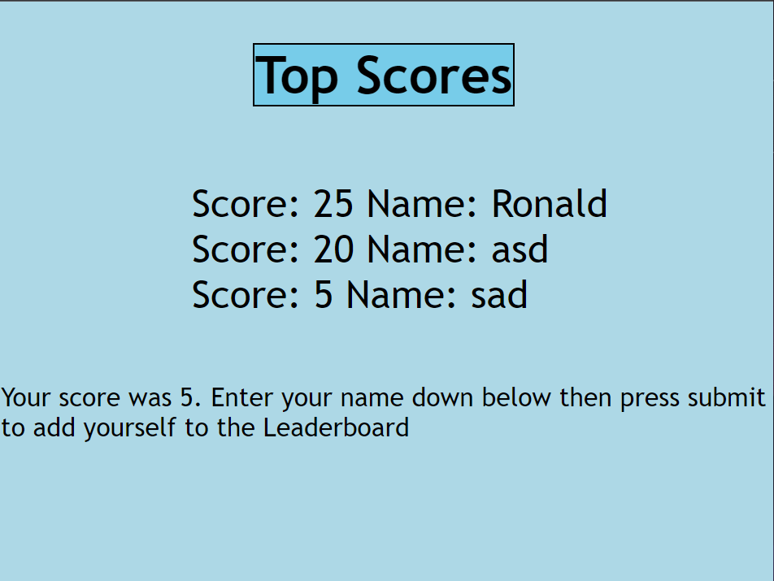

# potential-octo-quiz
To show my understanding of API's 

## User Story

```
AS A coding boot camp student
I WANT to take a timed quiz on JavaScript fundamentals that stores high scores
SO THAT I can gauge my progress compared to my peers
```

## Acceptance Criteria

```
GIVEN I am taking a code quiz
WHEN I click the start button
THEN a timer starts and I am presented with a question
WHEN I answer a question
THEN I am presented with another question
WHEN I answer a question incorrectly
THEN time is subtracted from the clock
WHEN all questions are answered or the timer reaches 0
THEN the game is over
WHEN the game is over
THEN I can save my initials and my score
```


## Deployment

[Link to the website](https://ronaldmartin02.github.io/potential-octo-quiz/)
 
 
 

## Usage

To use this , press the Start Quiz button. This will generate a math quiz when clicked. After you click the button you will have 20 seconds to finish the quiz. Once you answer all the questions or the time runs out it the highscore screen will pop up.  

## Credits

N/A

## License

MIT License